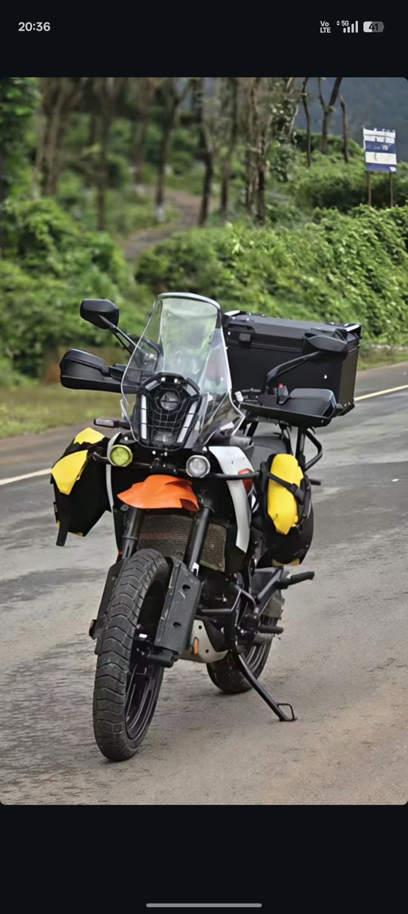

<!-- 
   ===============================================
   🌍 SRIDHAR.M - GitHub Profile README
   ===============================================
   Travel Enthusiast | Rider | Driver | Flyer | Developer
   Built with ❤️, fuel, and endless wanderlust
   ===============================================
-->


<div align="center">

  <h1>Hi there, I'm Sridhar.M 👋</h1>
  
  

  <h3>✈️ 🏍️ 🚗 Passionate traveler who codes on the go</h3>
  
  <p>
    <strong>I travel a lot — by bike, car, and airplane.</strong><br>
    Chasing sunsets, new roads, and fresh perspectives.
  </p>

  <!-- Social Badges -->
  <p>
    <a href="https://twitter.com/yourhandle"></a>
    <a href="https://linkedin.com/in/sridhar-m27"></a>
    <a href="https://instagram.com/justt.sridhar_27"></a>
  </p>

  <hr>

</div>

## 🌎 About Me

- ✈️ **Travel Enthusiast** — Always on the move to explore new Destinations
- 🏍️ **Bike Rider** — Nothing beats the freedom of two wheels
- 🚗 **Road Tripper** — Long drives and scenic routes are my therapy
- ✈️ **Frequent Flyer** — Collecting miles and memories
- 💻 **Developer** by profession, **Explorer** by heart
- 📍 Digital Nomad — My office is wherever the signal is strong

> "The journey is the destination." — Anonymous

## 🛤️ My Travel Style

I love exploring new places whether it's:
- Twisting mountain roads on my bike and Ending the Imaginary pain🏍️
- Long highway drives with good music 🚗
- Spontaneous flights to unknown destinations ✈️

Every trip fuels my creativity and code.

## 💼 What I Do

- Build scalable web & mobile applications
- Create tools that help fellow travelers
- Contribute to open source while on the road
- Turn travel experiences into meaningful projects

## 🛠️ Technologies I Work With

<div align="center">

### Languages & Frameworks


### Tools I Can't Live Without


</div>

## 📊 GitHub Stats


## 🌟 Featured Projects

- **NomadLog** — Travel journaling app with offline mode
- **RoutePlanner** — Smart trip planning tool for bikers & drivers
- **SkyCoder** — Productivity tools for travelers & remote workers
- **WanderCode** — Collection of travel-inspired coding snippets

## 📍 Current Status

```bash
# Currently: On the road somewhere and exploring Somewhere and creating enthusiastic memories
# Mode: Exploring | Coding | Riding
