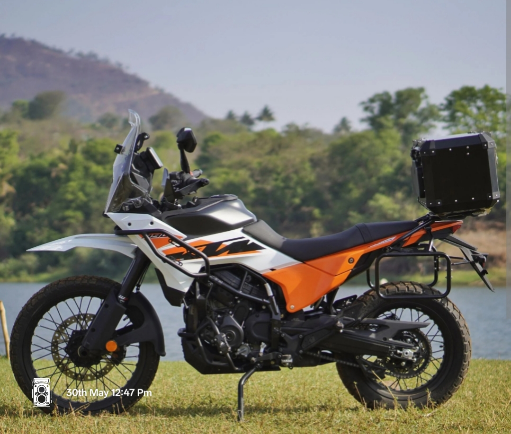

# 🏍️ Panther's South India Odyssey

**"Panther - The Untamed Spirit of the Roads"**  
*My KTM Adventure 390 — Conquering South India, one thrilling kilometer at a time.*

**Starting Point:** Krishnagiri, Tamil Nadu  
**Total Distance Travelled:** Over 4,200+ kilometers across multiple epic rides

---

Panther, my mighty **KTM Adventure 390**, has been my loyal companion on countless unforgettable rides across South India. From the chaotic yet energetic streets of Bangalore to the serene hill stations and golden coastlines, this machine has handled every kind of terrain with power, comfort, and pure character. Whether it was scorching highways, misty mountain roads, or long endurance runs, Panther never disappointed.

This is a chronicle of the places we have explored together so far.

### Destinations Conquered

**Bangalore**  
The heart of Karnataka and the starting point of most of my adventures. Panther and I have navigated through heavy city traffic as well as peaceful weekend escapes on the outskirts. The bike’s refined ergonomics and responsive throttle made even the daily grind feel exciting.

**Mysore**  
A royal ride filled with smooth highways and scenic stretches. Riding past the illuminated Mysore Palace during sunset was magical. Panther felt majestic on these roads, delivering effortless performance and stability throughout the journey.

**Mangalore**  
Coastal Karnataka at its finest. We devoured the beautiful ghats and winding roads leading to the Arabian Sea. The combination of sea breeze, spicy coastal food stops, and Panther’s capable handling made this one of the most enjoyable rides.

**Hyderabad**  
Long-distance highway runs on the NH44 tested Panther’s true capabilities. The 390cc engine shone brightly during high-speed cruising while maintaining excellent stability. Exploring the historic city and enjoying authentic Hyderabadi biryani after long rides was the perfect reward.

**Munnar**  
**The undisputed highlight of all our travels.** The misty mountains, endless tea plantations, and thrilling series of hairpin bends challenged both rider and machine. Panther was an absolute beast on the Kerala ghats — planted, powerful, and incredibly fun. Zero fatigue even after hours of continuous riding through the clouds.

**Visakhapatnam (Vizag)**  
Riding along the stunning Eastern coastline with the Bay of Bengal on one side was breathtaking. Panther loved the open coastal highways, offering smooth performance and comfortable cruising while we soaked in the sea views and golden beaches.

**Nellore**  
A hot and demanding transit ride that truly tested endurance. The blazing Andhra sun and long straight highways were handled effortlessly by Panther. Quick food stops with spicy local cuisine gave us the energy to keep pushing forward.

**Tirupati**  
A spiritual and scenic ride up the hills of Tirumala. Early morning rides with cool mountain air and the divine atmosphere made this journey special. Panther climbed the ghat roads gracefully even with full luggage, proving its versatility once again.

---

### My Verdict on Panther

After thousands of kilometers across varied South Indian landscapes, the **KTM Adventure 390** has proven to be a phenomenal all-rounder. It delivers thrilling performance when needed, remains comfortable for long rides, and feels confident on both highways and twisty mountain roads. Panther has become more than just a bike — it’s a trusted partner in exploration.

**Next destinations on the radar:** Coorg, Ooty, Hampi, and the backwaters of Kerala.

---

*Ride Safe. Ride Far.* 🏍️❤️
