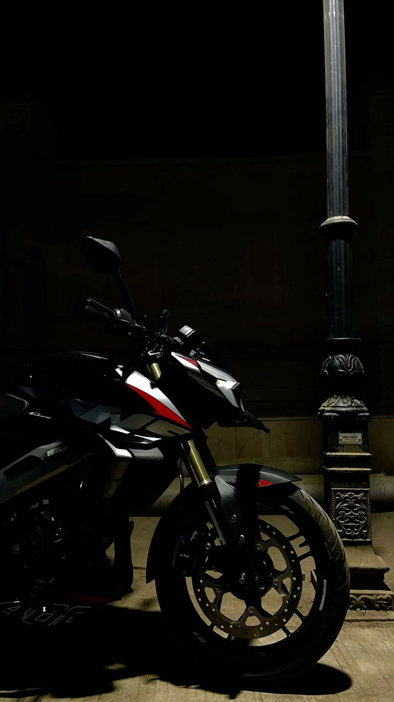

# 🏍️ NS400z Indian Odyssey

**"NS400z - The Relentless Road Dominator"**  
*My Bajaj Pulsar NS400z — Blazing across India, one powerful kilometer at a time.*

**Starting Point:** Krishnagiri, Tamil Nadu  
**Total Distance Travelled:** 8,650 kilometers across multiple epic rides

---

The **NS400z** has been an absolute powerhouse and my trusted companion on an unforgettable journey across India. Starting from Krishnagiri in Tamil Nadu, this machine has tackled everything — chaotic metropolitan traffic, smooth national highways, rugged Rajasthan stretches, misty Western Ghats, and the southernmost tip of the country. With its punchy performance, sharp handling, and comfortable ergonomics, the NS400z has proven itself as a true mile-muncher that never backs down from a challenge.

This is a chronicle of the incredible destinations we have conquered together.

### Destinations Conquered

**Mumbai**  
The city of dreams and a major milestone on this journey. Long highway runs from Krishnagiri through multiple states brought us here. Navigating through iconic Marine Drive and heavy traffic, the NS400z felt agile and responsive even in the madness of Mumbai.

**Nashik**  
A spiritual and scenic ride through the Western Ghats. Rolling hills, vineyards, and smooth highways made this stretch enjoyable. The NS400z’s mid-range torque shone brightly while climbing the ghats with ease and confidence.

**Surat**  
Gujarat’s bustling diamond city. Long highway runs with strong coastal winds tested stability. The bike remained planted at highway speeds and offered excellent comfort during the hot and humid stretches.

**Jaipur**  
The Pink City adventure in Rajasthan. Riding through the arid landscapes and historic routes was a completely different experience. The NS400z handled the long straight highways and occasional rough patches with remarkable poise and power.

**Palakkad**  
Gateway to Kerala. Crossing the Western Ghats into God’s Own Country was thrilling. The NS400z devoured the winding ghat roads with precise handling and strong braking, making the transition seamless.

**Allepuzha (Alleppey)**  
Backwater paradise. Cruising along the scenic roads beside the famous Kerala backwaters was pure bliss. The bike’s comfort allowed relaxed rides while soaking in the beautiful landscapes and houseboat views.

**Trivandrum (Thiruvananthapuram)**  
The southern capital with rich heritage and beautiful beaches. Exploring Kovalam and the city’s serene roads felt refreshing. The NS400z delivered smooth performance even after thousands of kilometers accumulated.

**Belgaum**  
A key stop in Karnataka with pleasant weather and historic charm. The highway stretches leading here tested long-distance endurance. The NS400z remained vibration-free and comfortable throughout the journey.

**Kanyakumari**  
The southernmost tip of India — a dream destination. Riding to the point where three seas meet was an emotional and spiritual high. The NS400z stood strong on the final legs, carrying me to this iconic landmark with zero complaints.

**Thanjavur**  
The land of grand temples and Chola architecture. Peaceful rides through Tamil Nadu’s countryside and the majestic Brihadeeswarar Temple made this stop unforgettable. The bike handled the temple town roads gracefully.

---

### My Verdict on NS400z

After covering **exactly 8,650 kilometers** across diverse Indian terrains — from the deserts of Rajasthan to the ghats of Kerala and the tip of Kanyakumari — starting all the way from Krishnagiri, the **Pulsar NS400z** has proven to be a formidable all-rounder. It offers thrilling power, confident handling, and surprising comfort for long tours. This bike has become far more than a machine — it’s a reliable partner that fuels every adventure.

**Next destinations on the radar:** Goa, Hampi, Coorg, and the Northeast.

---

*Ride Safe. Ride Far.* 🏍️❤️
